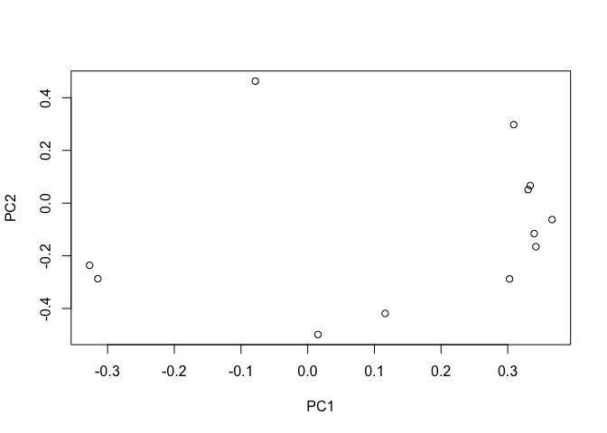

hw01-Hao-Wang
================

#### (2)

``` r
auto_imports_data <- read.csv('imports-85.data', sep = ",")
```

``` r
column_names <- c(
                  "symboling",
                  "normalized_losses",
                  "make",
                  "fuel_type",
                  "aspiration",
                  "num_of_doors",
                  "body_style",
                  "drive_wheels",
                  "engine_location",
                  "wheel_base",
                  "length",
                  "width",
                  "height",
                  "curb_weight",
                  "engine_type",
                  "num_of_cylinders",
                  "engine_size",
                  "fuel_system",
                  "bore",
                  "stroke",
                  "compression_ratio",
                  "horsepower",
                  "peak_rpm",
                  "city_mpg",
                  "highway_mpg",
                  "price"
                 )
```

``` r
column_types <- c(
                   'integer',
                   'character',
                   'character',
                   'character',
                   'character',
                   'character',
                   'character',
                   'character',
                   'character',
                   'real',
                   'real',
                   'real',
                   'real',
                   'integer',
                   'character',
                   'character',
                   'integer',
                   'character',
                   'character',
                   'character',
                   'real',
                   'integer',
                   'integer',
                   'integer',
                   'integer',
                   'integer'
                 )
```

``` r
auto_imports_data <- read.csv(
                              'imports-85.data',
                              sep = ",",
                              na = "?",
                              col.names = column_names,
                              colClasses = column_types,
                              stringsAsFactors = FALSE
                            )


str(auto_imports_data, vec.len = 1)
```

    ## 'data.frame':    204 obs. of  26 variables:
    ##  $ symboling        : int  3 1 ...
    ##  $ normalized_losses: chr  NA ...
    ##  $ make             : chr  "alfa-romero" ...
    ##  $ fuel_type        : chr  "gas" ...
    ##  $ aspiration       : chr  "std" ...
    ##  $ num_of_doors     : chr  "two" ...
    ##  $ body_style       : chr  "convertible" ...
    ##  $ drive_wheels     : chr  "rwd" ...
    ##  $ engine_location  : chr  "front" ...
    ##  $ wheel_base       : num  88.6 94.5 ...
    ##  $ length           : num  169 ...
    ##  $ width            : num  64.1 65.5 ...
    ##  $ height           : num  48.8 52.4 ...
    ##  $ curb_weight      : int  2548 2823 ...
    ##  $ engine_type      : chr  "dohc" ...
    ##  $ num_of_cylinders : chr  "four" ...
    ##  $ engine_size      : int  130 152 ...
    ##  $ fuel_system      : chr  "mpfi" ...
    ##  $ bore             : chr  "3.47" ...
    ##  $ stroke           : chr  "2.68" ...
    ##  $ compression_ratio: num  9 9 ...
    ##  $ horsepower       : int  111 154 ...
    ##  $ peak_rpm         : int  5000 5000 ...
    ##  $ city_mpg         : int  21 19 ...
    ##  $ highway_mpg      : int  27 26 ...
    ##  $ price            : int  16500 16500 ...

``` r
library(readr)
auto_imports_data_2 <- read_csv(
                                  file = "imports-85.data", 
                                  col_names = column_names,
                                  na = "?",
                                  col_types = list(
                                                    .default = col_character(),
                                                    "symboling" = col_integer(),
                                                    "wheel_base" = col_double(),
                                                    "length" = col_double(),
                                                    "width" = col_double(),
                                                    "height" = col_double(),
                                                    'curb_weight' = col_integer(),
                                                    'engine_size' = col_integer(),
                                                    'compression_ratio' = col_double(),
                                                    'horsepower' = col_integer(),
                                                    'city_mpg' = col_integer(),
                                                    'peak_rpm' = col_integer(),
                                                    'highway_mpg' = col_integer(),
                                                    'price' = col_integer()
                                                  )
                                  
                                )

str(auto_imports_data_2, vec.len = 1)
```

    ## Classes 'tbl_df', 'tbl' and 'data.frame':    205 obs. of  26 variables:
    ##  $ symboling        : int  3 3 ...
    ##  $ normalized_losses: chr  NA ...
    ##  $ make             : chr  "alfa-romero" ...
    ##  $ fuel_type        : chr  "gas" ...
    ##  $ aspiration       : chr  "std" ...
    ##  $ num_of_doors     : chr  "two" ...
    ##  $ body_style       : chr  "convertible" ...
    ##  $ drive_wheels     : chr  "rwd" ...
    ##  $ engine_location  : chr  "front" ...
    ##  $ wheel_base       : num  88.6 88.6 ...
    ##  $ length           : num  169 ...
    ##  $ width            : num  64.1 64.1 ...
    ##  $ height           : num  48.8 48.8 ...
    ##  $ curb_weight      : int  2548 2548 ...
    ##  $ engine_type      : chr  "dohc" ...
    ##  $ num_of_cylinders : chr  "four" ...
    ##  $ engine_size      : int  130 130 ...
    ##  $ fuel_system      : chr  "mpfi" ...
    ##  $ bore             : chr  "3.47" ...
    ##  $ stroke           : chr  "2.68" ...
    ##  $ compression_ratio: num  9 9 ...
    ##  $ horsepower       : int  111 111 ...
    ##  $ peak_rpm         : int  5000 5000 ...
    ##  $ city_mpg         : int  21 21 ...
    ##  $ highway_mpg      : int  27 27 ...
    ##  $ price            : int  13495 16500 ...
    ##  - attr(*, "spec")=List of 2
    ##   ..$ cols   :List of 26
    ##   .. ..$ symboling        : list()
    ##   .. .. ..- attr(*, "class")= chr  "collector_integer" ...
    ##   .. ..$ normalized_losses: list()
    ##   .. .. ..- attr(*, "class")= chr  "collector_character" ...
    ##   .. ..$ make             : list()
    ##   .. .. ..- attr(*, "class")= chr  "collector_character" ...
    ##   .. ..$ fuel_type        : list()
    ##   .. .. ..- attr(*, "class")= chr  "collector_character" ...
    ##   .. ..$ aspiration       : list()
    ##   .. .. ..- attr(*, "class")= chr  "collector_character" ...
    ##   .. ..$ num_of_doors     : list()
    ##   .. .. ..- attr(*, "class")= chr  "collector_character" ...
    ##   .. ..$ body_style       : list()
    ##   .. .. ..- attr(*, "class")= chr  "collector_character" ...
    ##   .. ..$ drive_wheels     : list()
    ##   .. .. ..- attr(*, "class")= chr  "collector_character" ...
    ##   .. ..$ engine_location  : list()
    ##   .. .. ..- attr(*, "class")= chr  "collector_character" ...
    ##   .. ..$ wheel_base       : list()
    ##   .. .. ..- attr(*, "class")= chr  "collector_double" ...
    ##   .. ..$ length           : list()
    ##   .. .. ..- attr(*, "class")= chr  "collector_double" ...
    ##   .. ..$ width            : list()
    ##   .. .. ..- attr(*, "class")= chr  "collector_double" ...
    ##   .. ..$ height           : list()
    ##   .. .. ..- attr(*, "class")= chr  "collector_double" ...
    ##   .. ..$ curb_weight      : list()
    ##   .. .. ..- attr(*, "class")= chr  "collector_integer" ...
    ##   .. ..$ engine_type      : list()
    ##   .. .. ..- attr(*, "class")= chr  "collector_character" ...
    ##   .. ..$ num_of_cylinders : list()
    ##   .. .. ..- attr(*, "class")= chr  "collector_character" ...
    ##   .. ..$ engine_size      : list()
    ##   .. .. ..- attr(*, "class")= chr  "collector_integer" ...
    ##   .. ..$ fuel_system      : list()
    ##   .. .. ..- attr(*, "class")= chr  "collector_character" ...
    ##   .. ..$ bore             : list()
    ##   .. .. ..- attr(*, "class")= chr  "collector_character" ...
    ##   .. ..$ stroke           : list()
    ##   .. .. ..- attr(*, "class")= chr  "collector_character" ...
    ##   .. ..$ compression_ratio: list()
    ##   .. .. ..- attr(*, "class")= chr  "collector_double" ...
    ##   .. ..$ horsepower       : list()
    ##   .. .. ..- attr(*, "class")= chr  "collector_integer" ...
    ##   .. ..$ peak_rpm         : list()
    ##   .. .. ..- attr(*, "class")= chr  "collector_integer" ...
    ##   .. ..$ city_mpg         : list()
    ##   .. .. ..- attr(*, "class")= chr  "collector_integer" ...
    ##   .. ..$ highway_mpg      : list()
    ##   .. .. ..- attr(*, "class")= chr  "collector_integer" ...
    ##   .. ..$ price            : list()
    ##   .. .. ..- attr(*, "class")= chr  "collector_integer" ...
    ##   ..$ default: list()
    ##   .. ..- attr(*, "class")= chr  "collector_character" ...
    ##   ..- attr(*, "class")= chr "col_spec"

#### (3)

#### a.

#### If don’t provide a vector of column names and simply invoke read.csv('imports-85.data'), the name of each column of the imported data would be the first value in each column.

#### b.

#### If don’t provide a vector of column names and invoke read.csv('imports-85.data', header = FALSE), the columns of the imported data would not have any sepecific names but ordered number from "V1" to "V26".

#### c.

#### When using the reading table functions, if don’t specify how missing values are codified, the data type of those columns that contain '?' would be factor.

#### d.

#### The main difference between two ways is that, the second specifies and changes the types of several columns from "character" to "integer" and from "factor" to "character". The reason that the data frame imported in the second option bigger (in terms of bytes) than the data frame imported in the first option is that when storing an R object, the stored data requiring more bytes as number that as character(words).

#### e.

#### if convert data frame as an R matrix, the data values in the resulting matrix would only include the column of numercial(num and int) types in the original data frame ignoring the other type of columns (chr).

#### (4)

-   histogram of price with colored bars.

``` r
colors <- c("red", "pink", "orange", "yellow", "green", "blue", "violet", "cyan", "purple")

hist(
  auto_imports_data$price,
  col = colors,
  main = "Histogram of Price",
  xlab = "Price"
  )
```


-   boxplot of horsepower in horizontal orientation.

``` r
boxplot(
  auto_imports_data$horsepower, 
  horizontal = TRUE
  )
```


-   barplot of the frequencies of body\_style, arranged in decreasing order.

``` r
body_syle <- auto_imports_data$body_style

body_syle_frequence <- table(body_syle)

body_syle_frequence_dcr <- sort(body_syle_frequence, decreasing = TRUE)

body_syle_frequence_dcr
```

    ## body_syle
    ##       sedan   hatchback       wagon     hardtop convertible 
    ##          96          70          25           8           5

``` r
barplot(body_syle_frequence_dcr)
```


-   stars() plot of vehicles with turbo aspiration, using only variables wheel-base, length, width, height, and price.

``` r
vehicles_turbo <- auto_imports_data[auto_imports_data$aspiration == "turbo", c("wheel_base", "length","width", "height", "price")]

vehicles_turbo
```

    ##     wheel_base length width height price
    ## 8        105.8  192.7  71.4   55.9 23875
    ## 9         99.5  178.2  67.9   52.0    NA
    ## 23        93.7  157.3  63.8   50.8  7957
    ## 27        93.7  157.3  63.8   50.6  8558
    ## 29        95.9  173.2  66.3   50.2 12964
    ## 67       110.0  190.9  70.3   56.5 25552
    ## 68       110.0  190.9  70.3   58.7 28248
    ## 69       106.7  187.5  70.3   54.9 28176
    ## 70       115.6  202.6  71.7   56.3 31600
    ## 75       102.7  178.4  68.0   54.8 16503
    ## 79        93.0  157.3  63.8   50.8  7689
    ## 80        96.3  173.0  65.4   49.4  9959
    ## 82        95.9  173.2  66.3   50.2 12629
    ## 83        95.9  173.2  66.3   50.2 14869
    ## 84        95.9  173.2  66.3   50.2 14489
    ## 87        96.3  172.4  65.4   51.6  9279
    ## 105       91.3  170.7  67.9   49.7 19699
    ## 108      107.9  186.7  68.4   56.7 13200
    ## 110      114.2  198.9  68.4   58.7 13860
    ## 112      107.9  186.7  68.4   56.7 16900
    ## 114      114.2  198.9  68.4   58.7 17075
    ## 116      107.9  186.7  68.4   56.7 17950
    ## 117      108.0  186.7  68.3   56.0 18150
    ## 119       93.7  157.3  63.8   50.8  7957
    ## 124       95.9  173.2  66.3   50.2 12764
    ## 136       99.1  186.6  66.5   56.1 18150
    ## 137       99.1  186.6  66.5   56.1 18620
    ## 145       97.0  172.0  65.4   54.3 11259
    ## 149       96.9  173.6  65.4   54.9 11694
    ## 174      102.4  175.6  66.5   54.9 10698
    ## 187       97.3  171.7  65.5   55.7  9495
    ## 192      100.4  180.2  66.9   55.1 13845
    ## 198      104.3  188.8  67.2   56.2 18420
    ## 199      104.3  188.8  67.2   57.5 18950
    ## 201      109.1  188.8  68.8   55.5 19045
    ## 203      109.1  188.8  68.9   55.5 22470
    ## 204      109.1  188.8  68.9   55.5 22625

``` r
stars(vehicles_turbo) 
```


#### (5)

#### a. What is the mean price of fuel\_type gas cars? And what is the mean price of fuel\_type diesel cars? (removing missing values)

``` r
price_gas <- auto_imports_data[auto_imports_data$fuel_type == "gas", "price"]

price_gas
```

    ##   [1] 16500 16500 13950 17450 15250 17710 18920 23875    NA 16430 16925
    ##  [12] 20970 21105 24565 30760 41315 36880  5151  6295  6575  5572  6377
    ##  [23]  7957  6229  6692  7609  8558  8921 12964  6479  6855  5399  6529
    ##  [34]  7129  7295  7295  7895  9095  8845 10295 12945 10345  6785    NA
    ##  [45]    NA 11048 32250 35550 36000  5195  6095  6795  6695  7395 10945
    ##  [56] 11845 13645 15645  8845  8495 10595 10245 11245 18280 34184 35056
    ##  [67] 40960 45400 16503  5389  6189  6669  7689  9959  8499 12629 14869
    ##  [78] 14489  6989  8189  9279  9279  5499  6649  6849  7349  7299  7799
    ##  [89]  7499  7999  8249  8949  9549 13499 14399 13499 17199 19699 18399
    ## [100] 11900 12440 15580 16695 16630 18150  5572  7957  6229  6692  7609
    ## [111]  8921 12764 22018 32528 34028 37028    NA  9295  9895 11850 12170
    ## [122] 15040 15510 18150 18620  5118  7053  7603  7126  7775  9960  9233
    ## [133] 11259  7463 10198  8013 11694  5348  6338  6488  6918  7898  8778
    ## [144]  6938  7198  7738  8358  9258  8058  8238  9298  9538  8449  9639
    ## [155]  9989 11199 11549 17669  8948  9988 10898 11248 16558 15998 15690
    ## [166] 15750  7975  8195  8495  9995 11595  9980 13295 12290 12940 13415
    ## [177] 15985 16515 18420 18950 16845 19045 21485 22625

``` r
mean_price_gas <- mean(price_gas, na.rm = TRUE)

mean_price_gas
```

    ## [1] 12913.19

``` r
price_diesel <- auto_imports_data[auto_imports_data$fuel_type == "diesel", "price"]

price_diesel
```

    ##  [1] 10795 18344 25552 28248 28176 31600  7099 13200 13860 16900 17075
    ## [12] 17950  7898  7788 10698  7775  7995  9495 13845 22470

``` r
mean_price_diesel <- mean(price_diesel, na.rm = TRUE)

mean_price_diesel
```

    ## [1] 15838.15

#### b. What is the make of the car with twelve num\_of\_cylinders?

``` r
vehicle_twelve_cylinders <- auto_imports_data[auto_imports_data$num_of_cylinders == "twelve", "make"]

vehicle_twelve_cylinders
```

    ## [1] "jaguar"

#### c. What is the make that has the most diesel cars?

``` r
make_diesel <- auto_imports_data[auto_imports_data$fuel_type == "diesel", "make"]

names(which.max(table(make_diesel))) 
```

    ## [1] "peugot"

#### d. What is the price of the car with the largest amount of horsepower?

``` r
price_largest_horsepower <- auto_imports_data$price[which.max(auto_imports_data$horsepower)]

price_largest_horsepower
```

    ## [1] NA

#### e. What is the bottom 10th percentile of city\_mpg?

``` r
quantile(auto_imports_data$city_mpg, .10)
```

    ## 10% 
    ##  17

#### f. What is the top 10th percentile of highway\_mpg?

``` r
quantile(auto_imports_data$highway_mpg, .90)
```

    ## 90% 
    ##  38

##### g. What is the median price of those cars in the bottom 10th percentile of city\_mpg?

``` r
price_bottom_10th <- auto_imports_data[auto_imports_data$city_mpg == "17", "price"]

price_bottom_10th
```

    ##  [1] 23875 10945 11845 13645 13499 14399 19699 32528 34028 37028    NA
    ## [12] 18420 18950

``` r
median(price_bottom_10th, na.rm = TRUE)
```

    ## [1] 18685

#### (5)

#### a.

#### If we use dollar operator $ on a dataframe using the name of a column that does not exist, it would give us "NULL" for nothing.

#### b.

#### The 4th commands, auto\_data\_frame\[ ,make\], fails to return the vector mpg. If we don't use cotation on make, like "make", r would regard it as an object instead a name of column and could not find it, which turns our to be error and would not give us the desired vector.

#### c.

#### The 4th command fails to retur the desired vector because if we don't use cotation on 'make', like the 7th command, mtcars\[ ,"mpg"\], r would regard 'make' as a name of an object instead a name of column and could not find such object, which turns out to be error and would not give us the desired vector.

#### d.

#### Yes, we can include an R list as a “column” of a data frame. A list is a generic vector containing other objects. As long as the length of each list is equal to the lenght of each column of the dataframe, we are able to add a list as a coulum of a data frame.

#### e.

#### If we apply as.list() to a data frame, this command will convert each column to a list, while the name of each column becomes the name of the coresponding list.

#### f.

#### We can use function data.frame() to convert the object abc genrated by the command abc &lt;- as.list(mtcars) into a data frame.

#### (7)

``` r
#find the columns that we need to construct a new data frame
wheel_base <- auto_imports_data$wheel_base
length <- auto_imports_data$length
width <- auto_imports_data$width
height <- auto_imports_data$height
curb_weight <- auto_imports_data$curb_weight
engine_size <- auto_imports_data$engine_size
compression_ratio <- auto_imports_data$compression_ratio
horsepower <- auto_imports_data$horsepower
peak_rpm <- auto_imports_data$peak_rpm
city_mpg <- auto_imports_data$city_mpg
highway_mpg <- auto_imports_data$highway_mpg
price <- auto_imports_data$price
#create a new data frame with the quantitative variables
df <- data.frame(
                  wheel_base,
                  length,
                  width,
                  height,
                  curb_weight,
                  engine_size,
                  compression_ratio,
                  horsepower,
                  peak_rpm,
                  city_mpg,
                  highway_mpg,
                  price
                )
#eliminating missing values#
qdat <- na.omit(df)

qdat
```

    ##     wheel_base length width height curb_weight engine_size
    ## 1         88.6  168.8  64.1   48.8        2548         130
    ## 2         94.5  171.2  65.5   52.4        2823         152
    ## 3         99.8  176.6  66.2   54.3        2337         109
    ## 4         99.4  176.6  66.4   54.3        2824         136
    ## 5         99.8  177.3  66.3   53.1        2507         136
    ## 6        105.8  192.7  71.4   55.7        2844         136
    ## 7        105.8  192.7  71.4   55.7        2954         136
    ## 8        105.8  192.7  71.4   55.9        3086         131
    ## 10       101.2  176.8  64.8   54.3        2395         108
    ## 11       101.2  176.8  64.8   54.3        2395         108
    ## 12       101.2  176.8  64.8   54.3        2710         164
    ## 13       101.2  176.8  64.8   54.3        2765         164
    ## 14       103.5  189.0  66.9   55.7        3055         164
    ## 15       103.5  189.0  66.9   55.7        3230         209
    ## 16       103.5  193.8  67.9   53.7        3380         209
    ## 17       110.0  197.0  70.9   56.3        3505         209
    ## 18        88.4  141.1  60.3   53.2        1488          61
    ## 19        94.5  155.9  63.6   52.0        1874          90
    ## 20        94.5  158.8  63.6   52.0        1909          90
    ## 21        93.7  157.3  63.8   50.8        1876          90
    ## 22        93.7  157.3  63.8   50.8        1876          90
    ## 23        93.7  157.3  63.8   50.8        2128          98
    ## 24        93.7  157.3  63.8   50.6        1967          90
    ## 25        93.7  157.3  63.8   50.6        1989          90
    ## 26        93.7  157.3  63.8   50.6        1989          90
    ## 27        93.7  157.3  63.8   50.6        2191          98
    ## 28       103.3  174.6  64.6   59.8        2535         122
    ## 29        95.9  173.2  66.3   50.2        2811         156
    ## 30        86.6  144.6  63.9   50.8        1713          92
    ## 31        86.6  144.6  63.9   50.8        1819          92
    ## 32        93.7  150.0  64.0   52.6        1837          79
    ## 33        93.7  150.0  64.0   52.6        1940          92
    ## 34        93.7  150.0  64.0   52.6        1956          92
    ## 35        96.5  163.4  64.0   54.5        2010          92
    ## 36        96.5  157.1  63.9   58.3        2024          92
    ## 37        96.5  167.5  65.2   53.3        2236         110
    ## 38        96.5  167.5  65.2   53.3        2289         110
    ## 39        96.5  175.4  65.2   54.1        2304         110
    ## 40        96.5  175.4  62.5   54.1        2372         110
    ## 41        96.5  175.4  65.2   54.1        2465         110
    ## 42        96.5  169.1  66.0   51.0        2293         110
    ## 43        94.3  170.7  61.8   53.5        2337         111
    ## 46        96.0  172.6  65.2   51.4        2734         119
    ## 47       113.0  199.6  69.6   52.8        4066         258
    ## 48       113.0  199.6  69.6   52.8        4066         258
    ## 49       102.0  191.7  70.6   47.8        3950         326
    ## 50        93.1  159.1  64.2   54.1        1890          91
    ## 51        93.1  159.1  64.2   54.1        1900          91
    ## 52        93.1  159.1  64.2   54.1        1905          91
    ## 53        93.1  166.8  64.2   54.1        1945          91
    ## 54        93.1  166.8  64.2   54.1        1950          91
    ## 55        95.3  169.0  65.7   49.6        2380          70
    ## 56        95.3  169.0  65.7   49.6        2380          70
    ## 57        95.3  169.0  65.7   49.6        2385          70
    ## 58        95.3  169.0  65.7   49.6        2500          80
    ## 59        98.8  177.8  66.5   53.7        2385         122
    ## 60        98.8  177.8  66.5   55.5        2410         122
    ## 61        98.8  177.8  66.5   53.7        2385         122
    ## 62        98.8  177.8  66.5   55.5        2410         122
    ## 63        98.8  177.8  66.5   55.5        2443         122
    ## 64        98.8  177.8  66.5   55.5        2425         122
    ## 65       104.9  175.0  66.1   54.4        2670         140
    ## 66       104.9  175.0  66.1   54.4        2700         134
    ## 67       110.0  190.9  70.3   56.5        3515         183
    ## 68       110.0  190.9  70.3   58.7        3750         183
    ## 69       106.7  187.5  70.3   54.9        3495         183
    ## 70       115.6  202.6  71.7   56.3        3770         183
    ## 71       115.6  202.6  71.7   56.5        3740         234
    ## 72        96.6  180.3  70.5   50.8        3685         234
    ## 73       120.9  208.1  71.7   56.7        3900         308
    ## 74       112.0  199.2  72.0   55.4        3715         304
    ## 75       102.7  178.4  68.0   54.8        2910         140
    ## 76        93.7  157.3  64.4   50.8        1918          92
    ## 77        93.7  157.3  64.4   50.8        1944          92
    ## 78        93.7  157.3  64.4   50.8        2004          92
    ## 79        93.0  157.3  63.8   50.8        2145          98
    ## 80        96.3  173.0  65.4   49.4        2370         110
    ## 81        96.3  173.0  65.4   49.4        2328         122
    ## 82        95.9  173.2  66.3   50.2        2833         156
    ## 83        95.9  173.2  66.3   50.2        2921         156
    ## 84        95.9  173.2  66.3   50.2        2926         156
    ## 85        96.3  172.4  65.4   51.6        2365         122
    ## 86        96.3  172.4  65.4   51.6        2405         122
    ## 87        96.3  172.4  65.4   51.6        2403         110
    ## 88        96.3  172.4  65.4   51.6        2403         110
    ## 89        94.5  165.3  63.8   54.5        1889          97
    ## 90        94.5  165.3  63.8   54.5        2017         103
    ## 91        94.5  165.3  63.8   54.5        1918          97
    ## 92        94.5  165.3  63.8   54.5        1938          97
    ## 93        94.5  170.2  63.8   53.5        2024          97
    ## 94        94.5  165.3  63.8   54.5        1951          97
    ## 95        94.5  165.6  63.8   53.3        2028          97
    ## 96        94.5  165.3  63.8   54.5        1971          97
    ## 97        94.5  170.2  63.8   53.5        2037          97
    ## 98        95.1  162.4  63.8   53.3        2008          97
    ## 99        97.2  173.4  65.2   54.7        2324         120
    ## 100       97.2  173.4  65.2   54.7        2302         120
    ## 101      100.4  181.7  66.5   55.1        3095         181
    ## 102      100.4  184.6  66.5   56.1        3296         181
    ## 103      100.4  184.6  66.5   55.1        3060         181
    ## 104       91.3  170.7  67.9   49.7        3071         181
    ## 105       91.3  170.7  67.9   49.7        3139         181
    ## 106       99.2  178.5  67.9   49.7        3139         181
    ## 107      107.9  186.7  68.4   56.7        3020         120
    ## 108      107.9  186.7  68.4   56.7        3197         152
    ## 109      114.2  198.9  68.4   58.7        3230         120
    ## 110      114.2  198.9  68.4   58.7        3430         152
    ## 111      107.9  186.7  68.4   56.7        3075         120
    ## 112      107.9  186.7  68.4   56.7        3252         152
    ## 113      114.2  198.9  68.4   56.7        3285         120
    ## 114      114.2  198.9  68.4   58.7        3485         152
    ## 115      107.9  186.7  68.4   56.7        3075         120
    ## 116      107.9  186.7  68.4   56.7        3252         152
    ## 117      108.0  186.7  68.3   56.0        3130         134
    ## 118       93.7  157.3  63.8   50.8        1918          90
    ## 119       93.7  157.3  63.8   50.8        2128          98
    ## 120       93.7  157.3  63.8   50.6        1967          90
    ## 121       93.7  167.3  63.8   50.8        1989          90
    ## 122       93.7  167.3  63.8   50.8        2191          98
    ## 123      103.3  174.6  64.6   59.8        2535         122
    ## 124       95.9  173.2  66.3   50.2        2818         156
    ## 125       94.5  168.9  68.3   50.2        2778         151
    ## 126       89.5  168.9  65.0   51.6        2756         194
    ## 127       89.5  168.9  65.0   51.6        2756         194
    ## 128       89.5  168.9  65.0   51.6        2800         194
    ## 132       99.1  186.6  66.5   56.1        2658         121
    ## 133       99.1  186.6  66.5   56.1        2695         121
    ## 134       99.1  186.6  66.5   56.1        2707         121
    ## 135       99.1  186.6  66.5   56.1        2758         121
    ## 136       99.1  186.6  66.5   56.1        2808         121
    ## 137       99.1  186.6  66.5   56.1        2847         121
    ## 138       93.7  156.9  63.4   53.7        2050          97
    ## 139       93.7  157.9  63.6   53.7        2120         108
    ## 140       93.3  157.3  63.8   55.7        2240         108
    ## 141       97.2  172.0  65.4   52.5        2145         108
    ## 142       97.2  172.0  65.4   52.5        2190         108
    ## 143       97.2  172.0  65.4   52.5        2340         108
    ## 144       97.0  172.0  65.4   54.3        2385         108
    ## 145       97.0  172.0  65.4   54.3        2510         108
    ## 146       97.0  173.5  65.4   53.0        2290         108
    ## 147       97.0  173.5  65.4   53.0        2455         108
    ## 148       96.9  173.6  65.4   54.9        2420         108
    ## 149       96.9  173.6  65.4   54.9        2650         108
    ## 150       95.7  158.7  63.6   54.5        1985          92
    ## 151       95.7  158.7  63.6   54.5        2040          92
    ## 152       95.7  158.7  63.6   54.5        2015          92
    ## 153       95.7  169.7  63.6   59.1        2280          92
    ## 154       95.7  169.7  63.6   59.1        2290          92
    ## 155       95.7  169.7  63.6   59.1        3110          92
    ## 156       95.7  166.3  64.4   53.0        2081          98
    ## 157       95.7  166.3  64.4   52.8        2109          98
    ## 158       95.7  166.3  64.4   53.0        2275         110
    ## 159       95.7  166.3  64.4   52.8        2275         110
    ## 160       95.7  166.3  64.4   53.0        2094          98
    ## 161       95.7  166.3  64.4   52.8        2122          98
    ## 162       95.7  166.3  64.4   52.8        2140          98
    ## 163       94.5  168.7  64.0   52.6        2169          98
    ## 164       94.5  168.7  64.0   52.6        2204          98
    ## 165       94.5  168.7  64.0   52.6        2265          98
    ## 166       94.5  168.7  64.0   52.6        2300          98
    ## 167       98.4  176.2  65.6   52.0        2540         146
    ## 168       98.4  176.2  65.6   52.0        2536         146
    ## 169       98.4  176.2  65.6   52.0        2551         146
    ## 170       98.4  176.2  65.6   52.0        2679         146
    ## 171       98.4  176.2  65.6   52.0        2714         146
    ## 172       98.4  176.2  65.6   53.0        2975         146
    ## 173      102.4  175.6  66.5   54.9        2326         122
    ## 174      102.4  175.6  66.5   54.9        2480         110
    ## 175      102.4  175.6  66.5   53.9        2414         122
    ## 176      102.4  175.6  66.5   54.9        2414         122
    ## 177      102.4  175.6  66.5   53.9        2458         122
    ## 178      102.9  183.5  67.7   52.0        2976         171
    ## 179      102.9  183.5  67.7   52.0        3016         171
    ## 180      104.5  187.8  66.5   54.1        3131         171
    ## 181      104.5  187.8  66.5   54.1        3151         161
    ## 182       97.3  171.7  65.5   55.7        2261          97
    ## 183       97.3  171.7  65.5   55.7        2209         109
    ## 184       97.3  171.7  65.5   55.7        2264          97
    ## 185       97.3  171.7  65.5   55.7        2212         109
    ## 186       97.3  171.7  65.5   55.7        2275         109
    ## 187       97.3  171.7  65.5   55.7        2319          97
    ## 188       97.3  171.7  65.5   55.7        2300         109
    ## 189       94.5  159.3  64.2   55.6        2254         109
    ## 190       94.5  165.7  64.0   51.4        2221         109
    ## 191      100.4  180.2  66.9   55.1        2661         136
    ## 192      100.4  180.2  66.9   55.1        2579          97
    ## 193      100.4  183.1  66.9   55.1        2563         109
    ## 194      104.3  188.8  67.2   56.2        2912         141
    ## 195      104.3  188.8  67.2   57.5        3034         141
    ## 196      104.3  188.8  67.2   56.2        2935         141
    ## 197      104.3  188.8  67.2   57.5        3042         141
    ## 198      104.3  188.8  67.2   56.2        3045         130
    ## 199      104.3  188.8  67.2   57.5        3157         130
    ## 200      109.1  188.8  68.9   55.5        2952         141
    ## 201      109.1  188.8  68.8   55.5        3049         141
    ## 202      109.1  188.8  68.9   55.5        3012         173
    ## 203      109.1  188.8  68.9   55.5        3217         145
    ## 204      109.1  188.8  68.9   55.5        3062         141
    ##     compression_ratio horsepower peak_rpm city_mpg highway_mpg price
    ## 1                9.00        111     5000       21          27 16500
    ## 2                9.00        154     5000       19          26 16500
    ## 3               10.00        102     5500       24          30 13950
    ## 4                8.00        115     5500       18          22 17450
    ## 5                8.50        110     5500       19          25 15250
    ## 6                8.50        110     5500       19          25 17710
    ## 7                8.50        110     5500       19          25 18920
    ## 8                8.30        140     5500       17          20 23875
    ## 10               8.80        101     5800       23          29 16430
    ## 11               8.80        101     5800       23          29 16925
    ## 12               9.00        121     4250       21          28 20970
    ## 13               9.00        121     4250       21          28 21105
    ## 14               9.00        121     4250       20          25 24565
    ## 15               8.00        182     5400       16          22 30760
    ## 16               8.00        182     5400       16          22 41315
    ## 17               8.00        182     5400       15          20 36880
    ## 18               9.50         48     5100       47          53  5151
    ## 19               9.60         70     5400       38          43  6295
    ## 20               9.60         70     5400       38          43  6575
    ## 21               9.41         68     5500       37          41  5572
    ## 22               9.40         68     5500       31          38  6377
    ## 23               7.60        102     5500       24          30  7957
    ## 24               9.40         68     5500       31          38  6229
    ## 25               9.40         68     5500       31          38  6692
    ## 26               9.40         68     5500       31          38  7609
    ## 27               7.60        102     5500       24          30  8558
    ## 28               8.50         88     5000       24          30  8921
    ## 29               7.00        145     5000       19          24 12964
    ## 30               9.60         58     4800       49          54  6479
    ## 31               9.20         76     6000       31          38  6855
    ## 32              10.10         60     5500       38          42  5399
    ## 33               9.20         76     6000       30          34  6529
    ## 34               9.20         76     6000       30          34  7129
    ## 35               9.20         76     6000       30          34  7295
    ## 36               9.20         76     6000       30          34  7295
    ## 37               9.00         86     5800       27          33  7895
    ## 38               9.00         86     5800       27          33  9095
    ## 39               9.00         86     5800       27          33  8845
    ## 40               9.00         86     5800       27          33 10295
    ## 41               9.00        101     5800       24          28 12945
    ## 42               9.10        100     5500       25          31 10345
    ## 43               8.50         78     4800       24          29  6785
    ## 46               9.20         90     5000       24          29 11048
    ## 47               8.10        176     4750       15          19 32250
    ## 48               8.10        176     4750       15          19 35550
    ## 49              11.50        262     5000       13          17 36000
    ## 50               9.00         68     5000       30          31  5195
    ## 51               9.00         68     5000       31          38  6095
    ## 52               9.00         68     5000       31          38  6795
    ## 53               9.00         68     5000       31          38  6695
    ## 54               9.00         68     5000       31          38  7395
    ## 55               9.40        101     6000       17          23 10945
    ## 56               9.40        101     6000       17          23 11845
    ## 57               9.40        101     6000       17          23 13645
    ## 58               9.40        135     6000       16          23 15645
    ## 59               8.60         84     4800       26          32  8845
    ## 60               8.60         84     4800       26          32  8495
    ## 61               8.60         84     4800       26          32 10595
    ## 62               8.60         84     4800       26          32 10245
    ## 63              22.70         64     4650       36          42 10795
    ## 64               8.60         84     4800       26          32 11245
    ## 65               8.00        120     5000       19          27 18280
    ## 66              22.00         72     4200       31          39 18344
    ## 67              21.50        123     4350       22          25 25552
    ## 68              21.50        123     4350       22          25 28248
    ## 69              21.50        123     4350       22          25 28176
    ## 70              21.50        123     4350       22          25 31600
    ## 71               8.30        155     4750       16          18 34184
    ## 72               8.30        155     4750       16          18 35056
    ## 73               8.00        184     4500       14          16 40960
    ## 74               8.00        184     4500       14          16 45400
    ## 75               8.00        175     5000       19          24 16503
    ## 76               9.40         68     5500       37          41  5389
    ## 77               9.40         68     5500       31          38  6189
    ## 78               9.40         68     5500       31          38  6669
    ## 79               7.60        102     5500       24          30  7689
    ## 80               7.50        116     5500       23          30  9959
    ## 81               8.50         88     5000       25          32  8499
    ## 82               7.00        145     5000       19          24 12629
    ## 83               7.00        145     5000       19          24 14869
    ## 84               7.00        145     5000       19          24 14489
    ## 85               8.50         88     5000       25          32  6989
    ## 86               8.50         88     5000       25          32  8189
    ## 87               7.50        116     5500       23          30  9279
    ## 88               7.50        116     5500       23          30  9279
    ## 89               9.40         69     5200       31          37  5499
    ## 90              21.90         55     4800       45          50  7099
    ## 91               9.40         69     5200       31          37  6649
    ## 92               9.40         69     5200       31          37  6849
    ## 93               9.40         69     5200       31          37  7349
    ## 94               9.40         69     5200       31          37  7299
    ## 95               9.40         69     5200       31          37  7799
    ## 96               9.40         69     5200       31          37  7499
    ## 97               9.40         69     5200       31          37  7999
    ## 98               9.40         69     5200       31          37  8249
    ## 99               8.50         97     5200       27          34  8949
    ## 100              8.50         97     5200       27          34  9549
    ## 101              9.00        152     5200       17          22 13499
    ## 102              9.00        152     5200       17          22 14399
    ## 103              9.00        152     5200       19          25 13499
    ## 104              9.00        160     5200       19          25 17199
    ## 105              7.80        200     5200       17          23 19699
    ## 106              9.00        160     5200       19          25 18399
    ## 107              8.40         97     5000       19          24 11900
    ## 108             21.00         95     4150       28          33 13200
    ## 109              8.40         97     5000       19          24 12440
    ## 110             21.00         95     4150       25          25 13860
    ## 111              8.40         95     5000       19          24 15580
    ## 112             21.00         95     4150       28          33 16900
    ## 113              8.40         95     5000       19          24 16695
    ## 114             21.00         95     4150       25          25 17075
    ## 115              8.40         97     5000       19          24 16630
    ## 116             21.00         95     4150       28          33 17950
    ## 117              7.00        142     5600       18          24 18150
    ## 118              9.40         68     5500       37          41  5572
    ## 119              7.60        102     5500       24          30  7957
    ## 120              9.40         68     5500       31          38  6229
    ## 121              9.40         68     5500       31          38  6692
    ## 122              9.40         68     5500       31          38  7609
    ## 123              8.50         88     5000       24          30  8921
    ## 124              7.00        145     5000       19          24 12764
    ## 125              9.50        143     5500       19          27 22018
    ## 126              9.50        207     5900       17          25 32528
    ## 127              9.50        207     5900       17          25 34028
    ## 128              9.50        207     5900       17          25 37028
    ## 132              9.31        110     5250       21          28 11850
    ## 133              9.30        110     5250       21          28 12170
    ## 134              9.30        110     5250       21          28 15040
    ## 135              9.30        110     5250       21          28 15510
    ## 136              9.00        160     5500       19          26 18150
    ## 137              9.00        160     5500       19          26 18620
    ## 138              9.00         69     4900       31          36  5118
    ## 139              8.70         73     4400       26          31  7053
    ## 140              8.70         73     4400       26          31  7603
    ## 141              9.50         82     4800       32          37  7126
    ## 142              9.50         82     4400       28          33  7775
    ## 143              9.00         94     5200       26          32  9960
    ## 144              9.00         82     4800       24          25  9233
    ## 145              7.70        111     4800       24          29 11259
    ## 146              9.00         82     4800       28          32  7463
    ## 147              9.00         94     5200       25          31 10198
    ## 148              9.00         82     4800       23          29  8013
    ## 149              7.70        111     4800       23          23 11694
    ## 150              9.00         62     4800       35          39  5348
    ## 151              9.00         62     4800       31          38  6338
    ## 152              9.00         62     4800       31          38  6488
    ## 153              9.00         62     4800       31          37  6918
    ## 154              9.00         62     4800       27          32  7898
    ## 155              9.00         62     4800       27          32  8778
    ## 156              9.00         70     4800       30          37  6938
    ## 157              9.00         70     4800       30          37  7198
    ## 158             22.50         56     4500       34          36  7898
    ## 159             22.50         56     4500       38          47  7788
    ## 160              9.00         70     4800       38          47  7738
    ## 161              9.00         70     4800       28          34  8358
    ## 162              9.00         70     4800       28          34  9258
    ## 163              9.00         70     4800       29          34  8058
    ## 164              9.00         70     4800       29          34  8238
    ## 165              9.40        112     6600       26          29  9298
    ## 166              9.40        112     6600       26          29  9538
    ## 167              9.30        116     4800       24          30  8449
    ## 168              9.30        116     4800       24          30  9639
    ## 169              9.30        116     4800       24          30  9989
    ## 170              9.30        116     4800       24          30 11199
    ## 171              9.30        116     4800       24          30 11549
    ## 172              9.30        116     4800       24          30 17669
    ## 173              8.70         92     4200       29          34  8948
    ## 174             22.50         73     4500       30          33 10698
    ## 175              8.70         92     4200       27          32  9988
    ## 176              8.70         92     4200       27          32 10898
    ## 177              8.70         92     4200       27          32 11248
    ## 178              9.30        161     5200       20          24 16558
    ## 179              9.30        161     5200       19          24 15998
    ## 180              9.20        156     5200       20          24 15690
    ## 181              9.20        156     5200       19          24 15750
    ## 182             23.00         52     4800       37          46  7775
    ## 183              9.00         85     5250       27          34  7975
    ## 184             23.00         52     4800       37          46  7995
    ## 185              9.00         85     5250       27          34  8195
    ## 186              9.00         85     5250       27          34  8495
    ## 187             23.00         68     4500       37          42  9495
    ## 188             10.00        100     5500       26          32  9995
    ## 189              8.50         90     5500       24          29 11595
    ## 190              8.50         90     5500       24          29  9980
    ## 191              8.50        110     5500       19          24 13295
    ## 192             23.00         68     4500       33          38 13845
    ## 193              9.00         88     5500       25          31 12290
    ## 194              9.50        114     5400       23          28 12940
    ## 195              9.50        114     5400       23          28 13415
    ## 196              9.50        114     5400       24          28 15985
    ## 197              9.50        114     5400       24          28 16515
    ## 198              7.50        162     5100       17          22 18420
    ## 199              7.50        162     5100       17          22 18950
    ## 200              9.50        114     5400       23          28 16845
    ## 201              8.70        160     5300       19          25 19045
    ## 202              8.80        134     5500       18          23 21485
    ## 203             23.00        106     4800       26          27 22470
    ## 204              9.50        114     5400       19          25 22625

``` r
#calculate the correlation#
correlation <- cor(qdat)

correlation
```

    ##                   wheel_base     length      width      height curb_weight
    ## wheel_base         1.0000000  0.8826476  0.8172862  0.58582355   0.7881615
    ## length             0.8826476  1.0000000  0.8573301  0.49587969   0.8820737
    ## width              0.8172862  0.8573301  1.0000000  0.30426326   0.8684721
    ## height             0.5858235  0.4958797  0.3042633  1.00000000   0.3110030
    ## curb_weight        0.7881615  0.8820737  0.8684721  0.31100299   1.0000000
    ## engine_size        0.5780019  0.6857630  0.7311272  0.07716959   0.8493201
    ## compression_ratio  0.2484274  0.1609543  0.1903838  0.25968468   0.1563054
    ## horsepower         0.3760841  0.5810901  0.6173651 -0.08623558   0.7581577
    ## peak_rpm          -0.3653552 -0.2870380 -0.2475099 -0.31749752  -0.2794368
    ## city_mpg          -0.4824028 -0.6673299 -0.6377701 -0.05879051  -0.7511472
    ## highway_mpg       -0.5525978 -0.7010610 -0.6851788 -0.11201363  -0.7955640
    ## price              0.5882891  0.6943655  0.7553761  0.13675880   0.8350955
    ##                   engine_size compression_ratio  horsepower    peak_rpm
    ## wheel_base         0.57800195        0.24842743  0.37608413 -0.36535518
    ## length             0.68576298        0.16095425  0.58109010 -0.28703801
    ## width              0.73112723        0.19038380  0.61736514 -0.24750987
    ## height             0.07716959        0.25968468 -0.08623558 -0.31749752
    ## curb_weight        0.84932011        0.15630536  0.75815774 -0.27943681
    ## engine_size        1.00000000        0.02948623  0.82273215 -0.25672142
    ## compression_ratio  0.02948623        1.00000000 -0.21434335 -0.43654089
    ## horsepower         0.82273215       -0.21434335  1.00000000  0.10816074
    ## peak_rpm          -0.25672142       -0.43654089  0.10816074  1.00000000
    ## city_mpg          -0.65101058        0.33004581 -0.82291911 -0.11637692
    ## highway_mpg       -0.67998967        0.26827444 -0.80471793 -0.05932634
    ## price              0.87388982        0.06961110  0.81058705 -0.10162540
    ##                      city_mpg highway_mpg      price
    ## wheel_base        -0.48240276 -0.55259776  0.5882891
    ## length            -0.66732986 -0.70106099  0.6943655
    ## width             -0.63777014 -0.68517879  0.7553761
    ## height            -0.05879051 -0.11201363  0.1367588
    ## curb_weight       -0.75114723 -0.79556396  0.8350955
    ## engine_size       -0.65101058 -0.67998967  0.8738898
    ## compression_ratio  0.33004581  0.26827444  0.0696111
    ## horsepower        -0.82291911 -0.80471793  0.8105871
    ## peak_rpm          -0.11637692 -0.05932634 -0.1016254
    ## city_mpg           1.00000000  0.97276064 -0.6898935
    ## highway_mpg        0.97276064  1.00000000 -0.7056637
    ## price             -0.68989353 -0.70566371  1.0000000

``` r
#plot two correlogram
library(corrplot)
```

    ## Warning: package 'corrplot' was built under R version 3.4.2

    ## corrplot 0.84 loaded

``` r
corrplot(correlation, method = "color")
```


``` r
corrplot(correlation, method = "pie")
```


``` r
#comments on the patterns and values

# Consider the first correlogran. From the left upper corner to the right lower corner, the correlations of combinations of different variables shift from positive to negative except for the combinations on the diagonl. For the majority of those combinaitons on the diagonal, they have positive correlations equal to 1, becuase a varibe's correlation with itself is 1. Oberved that most combinations with correlaitons that are close to 0 are mainly spread in the region very close to the center of the diagram.
```

#### (8)

#### 8.1)

-   Use prcomp( ) to perform a principal components analysis on qdat; use the argument scale. = TRUE to carry out PCA on standardized data.

``` r
auto_imports_prcomp <- prcomp(qdat, scale. = TRUE)

auto_imports_prcomp
```

    ## Standard deviations (1, .., p=12):
    ##  [1] 2.6390876 1.5218903 0.9905225 0.7695060 0.6128011 0.5436954 0.3662035
    ##  [8] 0.3397836 0.2960354 0.2580724 0.2264908 0.1398850
    ## 
    ## Rotation (n x k) = (12 x 12):
    ##                           PC1         PC2         PC3         PC4
    ## wheel_base         0.30258628 -0.28778462  0.24154720 -0.04641334
    ## length             0.34218210 -0.16553197  0.18770312 -0.04172319
    ## width              0.33960196 -0.11562194 -0.02186886 -0.15189507
    ## height             0.11614214 -0.41879443  0.60212589 -0.02092831
    ## curb_weight        0.36643168 -0.06271913 -0.07186926 -0.01761538
    ## engine_size        0.33052094  0.05104314 -0.34416677  0.13461148
    ## compression_ratio  0.01539190 -0.49886587 -0.41010334 -0.55527921
    ## horsepower         0.30892524  0.29784292 -0.19373234 -0.03917992
    ## peak_rpm          -0.07848575  0.46293815  0.30516966 -0.77344331
    ## city_mpg          -0.31457941 -0.28703072 -0.17568246 -0.09593587
    ## highway_mpg       -0.32697354 -0.23615103 -0.17364306 -0.09243407
    ## price              0.33363839  0.06663074 -0.24476716 -0.16832100
    ##                           PC5         PC6         PC7          PC8
    ## wheel_base         0.18681587 -0.39461923  0.09930986 -0.518319809
    ## length             0.16154539 -0.11088086  0.41890059  0.006400371
    ## width              0.30197431 -0.39783528 -0.36278422  0.663870035
    ## height            -0.55552376  0.26137132 -0.07247958  0.220826217
    ## curb_weight        0.04237548  0.09253986  0.19245480 -0.031404735
    ## engine_size       -0.37200441 -0.18361645  0.23060898 -0.101065896
    ## compression_ratio  0.17131496  0.45355649  0.04634142 -0.047212553
    ## horsepower        -0.24694166  0.15242226  0.40311148  0.341479244
    ## peak_rpm          -0.08842236 -0.15403949  0.11606298 -0.067184188
    ## city_mpg          -0.24195940 -0.39869337  0.14073705  0.060143012
    ## highway_mpg       -0.26490652 -0.38060710  0.18940163  0.140952242
    ## price             -0.41491867 -0.08137701 -0.59479233 -0.289447517
    ##                           PC9         PC10        PC11        PC12
    ## wheel_base         0.24971515 -0.461093183  0.12005761  0.08124974
    ## length            -0.67818929  0.315739429  0.14211983 -0.15747063
    ## width              0.14497468  0.034537647  0.05712234  0.02193260
    ## height             0.12353050  0.021447874  0.03324204  0.01909701
    ## curb_weight        0.14935200  0.131085251 -0.87038855  0.10425272
    ## engine_size        0.40900123  0.482679911  0.33067967  0.08044532
    ## compression_ratio  0.07306939 -0.005260652  0.17048239  0.02250043
    ## horsepower        -0.05205540 -0.628018650  0.09225982 -0.08853683
    ## peak_rpm           0.11772078  0.154760323 -0.02288595  0.01792969
    ## city_mpg           0.06341951 -0.045144553 -0.20041001 -0.70102500
    ## highway_mpg       -0.25053243 -0.091356363 -0.09764915  0.66872973
    ## price             -0.40390661 -0.084354702 -0.07934378 -0.05580009

``` r
names(auto_imports_prcomp)
```

    ## [1] "sdev"     "rotation" "center"   "scale"    "x"

``` r
#eigenvalues

eigenvalues <- auto_imports_prcomp$sdev^2

eigenvalues
```

    ##  [1] 6.96478347 2.31615015 0.98113483 0.59213949 0.37552524 0.29560467
    ##  [7] 0.13410499 0.11545292 0.08763696 0.06660138 0.05129809 0.01956781

``` r
#determine the proportion of variation that is “captured” by the first three components.

eigs <- eigenvalues
eigs_perc <- 100 * eigs / sum(eigs)
eigs_cum <- cumsum(eigs_perc)

eigs_df <- data.frame(
  eigenvalue = eigs,
  percentage = eigs_perc,
  'cumulative percentage' = eigs_cum
)

print(round(eigs_df, 4), print.gap = 2)
```

    ##     eigenvalue  percentage  cumulative.percentage
    ## 1       6.9648     58.0399                58.0399
    ## 2       2.3162     19.3013                77.3411
    ## 3       0.9811      8.1761                85.5172
    ## 4       0.5921      4.9345                90.4517
    ## 5       0.3755      3.1294                93.5811
    ## 6       0.2956      2.4634                96.0445
    ## 7       0.1341      1.1175                97.1620
    ## 8       0.1155      0.9621                98.1241
    ## 9       0.0876      0.7303                98.8544
    ## 10      0.0666      0.5550                99.4095
    ## 11      0.0513      0.4275                99.8369
    ## 12      0.0196      0.1631               100.0000

#### 8.2) PCA plot of vehicles, and PCA plot of variables

``` r
loadings <- auto_imports_prcomp$rotation 

loadings
```

    ##                           PC1         PC2         PC3         PC4
    ## wheel_base         0.30258628 -0.28778462  0.24154720 -0.04641334
    ## length             0.34218210 -0.16553197  0.18770312 -0.04172319
    ## width              0.33960196 -0.11562194 -0.02186886 -0.15189507
    ## height             0.11614214 -0.41879443  0.60212589 -0.02092831
    ## curb_weight        0.36643168 -0.06271913 -0.07186926 -0.01761538
    ## engine_size        0.33052094  0.05104314 -0.34416677  0.13461148
    ## compression_ratio  0.01539190 -0.49886587 -0.41010334 -0.55527921
    ## horsepower         0.30892524  0.29784292 -0.19373234 -0.03917992
    ## peak_rpm          -0.07848575  0.46293815  0.30516966 -0.77344331
    ## city_mpg          -0.31457941 -0.28703072 -0.17568246 -0.09593587
    ## highway_mpg       -0.32697354 -0.23615103 -0.17364306 -0.09243407
    ## price              0.33363839  0.06663074 -0.24476716 -0.16832100
    ##                           PC5         PC6         PC7          PC8
    ## wheel_base         0.18681587 -0.39461923  0.09930986 -0.518319809
    ## length             0.16154539 -0.11088086  0.41890059  0.006400371
    ## width              0.30197431 -0.39783528 -0.36278422  0.663870035
    ## height            -0.55552376  0.26137132 -0.07247958  0.220826217
    ## curb_weight        0.04237548  0.09253986  0.19245480 -0.031404735
    ## engine_size       -0.37200441 -0.18361645  0.23060898 -0.101065896
    ## compression_ratio  0.17131496  0.45355649  0.04634142 -0.047212553
    ## horsepower        -0.24694166  0.15242226  0.40311148  0.341479244
    ## peak_rpm          -0.08842236 -0.15403949  0.11606298 -0.067184188
    ## city_mpg          -0.24195940 -0.39869337  0.14073705  0.060143012
    ## highway_mpg       -0.26490652 -0.38060710  0.18940163  0.140952242
    ## price             -0.41491867 -0.08137701 -0.59479233 -0.289447517
    ##                           PC9         PC10        PC11        PC12
    ## wheel_base         0.24971515 -0.461093183  0.12005761  0.08124974
    ## length            -0.67818929  0.315739429  0.14211983 -0.15747063
    ## width              0.14497468  0.034537647  0.05712234  0.02193260
    ## height             0.12353050  0.021447874  0.03324204  0.01909701
    ## curb_weight        0.14935200  0.131085251 -0.87038855  0.10425272
    ## engine_size        0.40900123  0.482679911  0.33067967  0.08044532
    ## compression_ratio  0.07306939 -0.005260652  0.17048239  0.02250043
    ## horsepower        -0.05205540 -0.628018650  0.09225982 -0.08853683
    ## peak_rpm           0.11772078  0.154760323 -0.02288595  0.01792969
    ## city_mpg           0.06341951 -0.045144553 -0.20041001 -0.70102500
    ## highway_mpg       -0.25053243 -0.091356363 -0.09764915  0.66872973
    ## price             -0.40390661 -0.084354702 -0.07934378 -0.05580009

``` r
loadings_df <- data.frame(loadings)

PC1 <- loadings_df$PC1

PC2 <- loadings_df$PC2

plot(PC1, PC2)
```



``` r
plot(auto_imports_prcomp$x, type = "n", las = 1)
abline(h = 0, v = 0)
points(auto_imports_prcomp$x[ ,1], auto_imports_prcomp$x[ ,2], pch = 19, 
       col = "#88888877")
```


-   Optionally, you can call biplot() of the "prcomop" object to get a simultaneous plot of both the vehicles and the variables.

``` r
biplot(auto_imports_prcomp)
```


#### Based on my plots, the data follows a positive correlated patterns centered at (0, 0). The density of the data is increasing as moving closer to point (0, 0). And from the tendency of the slope of this pattern, we can say this is a positive correlatedpattern.
