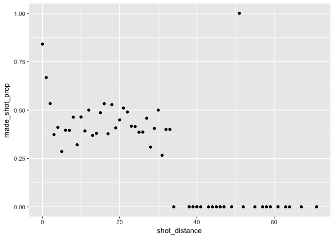
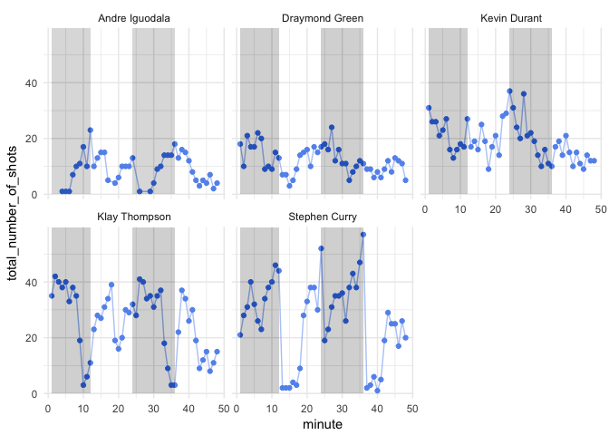

hw02
================
Hao Wang

``` r
knitr::opts_chunk$set(echo = TRUE, fig.path = '../images/')
load('hw02.Rdata')
```

``` r
library(dplyr)
```

    ## Warning: package 'dplyr' was built under R version 3.4.2

    ## 
    ## Attaching package: 'dplyr'

    ## The following objects are masked from 'package:stats':
    ## 
    ##     filter, lag

    ## The following objects are masked from 'package:base':
    ## 
    ##     intersect, setdiff, setequal, union

``` r
library(ggplot2)
```

``` r
dat %>% 
  group_by(name) %>%
  summarise(number_of_shots = n()) %>%
  arrange(number_of_shots)
```

    ## # A tibble: 5 x 2
    ##             name number_of_shots
    ##            <chr>           <int>
    ## 1 Andre Iguodala             371
    ## 2 Draymond Green             578
    ## 3   Kevin Durant             915
    ## 4  Klay Thompson            1220
    ## 5  Stephen Curry            1250

``` r
dat %>% 
  group_by(name) %>%
  summarise(total = n(),
            made = sum(shot_made_flag == "made shot"),
            perc_made = made / total) %>%
  arrange(desc(perc_made))
```

    ## # A tibble: 5 x 4
    ##             name total  made perc_made
    ##            <chr> <int> <int>     <dbl>
    ## 1   Kevin Durant   915   495 0.5409836
    ## 2 Andre Iguodala   371   192 0.5175202
    ## 3  Klay Thompson  1220   575 0.4713115
    ## 4  Stephen Curry  1250   584 0.4672000
    ## 5 Draymond Green   578   245 0.4238754

``` r
dat %>% 
  group_by(name) %>%
  summarise(total = sum(shot_type == "2PT Field Goal"),
            made = sum(shot_made_flag == "made shot" & shot_type == "2PT Field Goal"),
            perc_made = made / total) %>%
  arrange(desc(perc_made))
```

    ## # A tibble: 5 x 4
    ##             name total  made perc_made
    ##            <chr> <int> <int>     <dbl>
    ## 1 Andre Iguodala   210   134 0.6380952
    ## 2   Kevin Durant   643   390 0.6065319
    ## 3  Stephen Curry   563   304 0.5399645
    ## 4  Klay Thompson   640   329 0.5140625
    ## 5 Draymond Green   346   171 0.4942197

``` r
dat %>% 
  group_by(name) %>%
  summarise(total = sum(shot_type == "3PT Field Goal"),
            made = sum(shot_made_flag == "made shot" & shot_type == "3PT Field Goal"),
            perc_made = made / total) %>%
  arrange(desc(perc_made))
```

    ## # A tibble: 5 x 4
    ##             name total  made perc_made
    ##            <chr> <int> <int>     <dbl>
    ## 1  Klay Thompson   580   246 0.4241379
    ## 2  Stephen Curry   687   280 0.4075691
    ## 3   Kevin Durant   272   105 0.3860294
    ## 4 Andre Iguodala   161    58 0.3602484
    ## 5 Draymond Green   232    74 0.3189655

``` r
dp <- dat %>% 
  group_by(shot_distance) %>%
  summarise(made_shot_prop = sum(shot_made_flag == "made shot") / n() ) %>%
  arrange(shot_distance)
dp
```

    ## # A tibble: 56 x 2
    ##    shot_distance made_shot_prop
    ##            <int>          <dbl>
    ##  1             0      0.8410758
    ##  2             1      0.6683673
    ##  3             2      0.5335689
    ##  4             3      0.3734940
    ##  5             4      0.4107143
    ##  6             5      0.2857143
    ##  7             6      0.3958333
    ##  8             7      0.3953488
    ##  9             8      0.4634146
    ## 10             9      0.3207547
    ## # ... with 46 more rows

``` r
ggplot(data = dp) + geom_point(aes(x = shot_distance, y = made_shot_prop))
```



> What do you observe?

#### When the distance to the busket is small enough, the shot\_prop is considerablly high comparing with the other data. However, within certain range of shot distance arount 3 to 35, there does not exist any obvious relationship or pattern between shot distance and made shot prop. When the distance is above around 35, almost all of made shot prop are zero except an extrem value that equals to 1.

> Can you confirm that the shorter the distance, the more effective the shots?

#### No, I cannot. For different ranges of value of shot distance, the diagram shows different situations and we cannot conclude any comprehensive pattern from the graph.

> Can you guesstimate a distance threshold beyond which the chance of making a successful shot is basically null?

#### around 34 to 35

> What distances tend to have a percentage (of making a shot) of 50% or more?

#### the approximately qualified interval is \[0, 2\]

``` r
dat_2 <- dat %>% 
  group_by(name, minute) %>%
  summarise(total_number_of_shots = n())

ggplot(data = dat_2) + 
  geom_point(aes(x = minute, y = total_number_of_shots), color = "cornflowerblue") +
  facet_wrap(~ name) +
  geom_path(aes(x = minute, y = total_number_of_shots), color = "cornflowerblue", alpha = 0.5) +
  theme_minimal()+
  geom_rect(xmin = 1, xmax = 12, ymin = 0, ymax = 100, alpha = 0.005) +
  geom_rect(xmin = 24, xmax = 36, ymin = 0, ymax = 100, alpha = 0.005) +
   scale_x_continuous()
```


