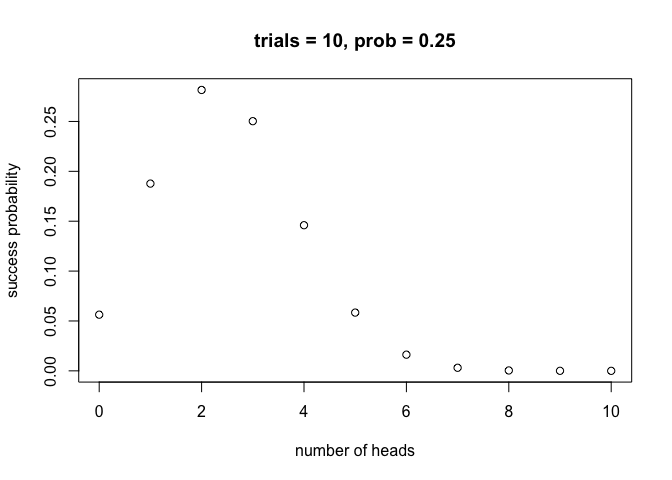
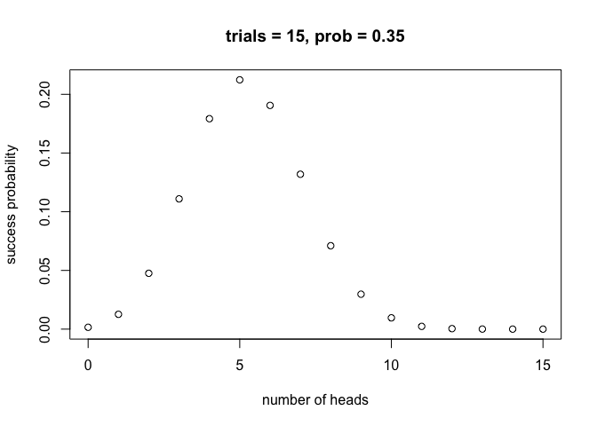

hw03
================
Hao Wang

``` r
library(ggplot2)
```

> 2

``` bash
cut -f 2 -d "," nba2017-roster.cvs |
tail +2 |
sort -u > team-names.txt
head -5 team-names.txt
```

    ## cut: nba2017-roster.cvs: No such file or directory

``` bash
cut -f 3 -d "," nba2017-roster.cvs |
tail +2 |
sort -u > position-names.txt
head -5 position-names.txt
```

    ## cut: nba2017-roster.cvs: No such file or directory

``` bash
cut -f 7 -d "," nba2017-roster.cvs |
tail +2 |
sort |
uniq -c |
sort -nr > experience-counts.txt
head -5 experience-counts.txt
```

    ## cut: nba2017-roster.cvs: No such file or directory

``` bash
grep -e LAC -e team nba2017-roster.cvs > LAC.csv
cat LAC.csv
```

    ## grep: nba2017-roster.cvs: No such file or directory

``` bash
grep "LAL" nba2017-roster.cvs | cut -d "," -f 6 | sort | uniq -c
```

    ## grep: nba2017-roster.cvs: No such file or directory

``` bash
grep "CLE" nba2017-roster.cvs |
wc -l
```

    ## grep: nba2017-roster.cvs: No such file or directory
    ##        0

``` bash
grep -e GSW -e player -e height -e weight nba2017-roster.cvs |
cut -d "," -f 1,4,5 > gsw-height-weight.csv

cat gsw-height-weight.csv
```

    ## grep: nba2017-roster.cvs: No such file or directory

``` bash
cut -d "," -f 1,8 nba2017-roster.cvs |
sort -t "," -k 2nr -k 1r |
head -n 10 > top10-salaries.csv

cat top10-salaries.csv
```

    ## cut: nba2017-roster.cvs: No such file or directory

> 3

``` r
source("../code/binomial-functions.R")
```

``` r
bin_probability(trials = 10, success = 3, prob = 1/6)
```

    ## [1] 0.1550454

``` r
distribution_1 <- bin_distribution(trials = 10, prob = 0.25)
plot(distribution_1, xlab = "number of heads", ylab = "success probability", main = "trials = 10, prob = 0.25")
```



``` r
n <- c(4:5)
probability <- 0

for ( k in n ) {
  prob_k <- bin_probability(trials = 5, success = k, prob = 0.35)
  probability <- probability + prob_k
}

probability
```

    ## [1] 0.0540225

``` r
distribution_2 <- bin_distribution(trials = 15, prob = 0.35)
plot(distribution_2 , xlab = "number of heads",ylab = "success probability", main = "trials = 15, prob = 0.35")
```


