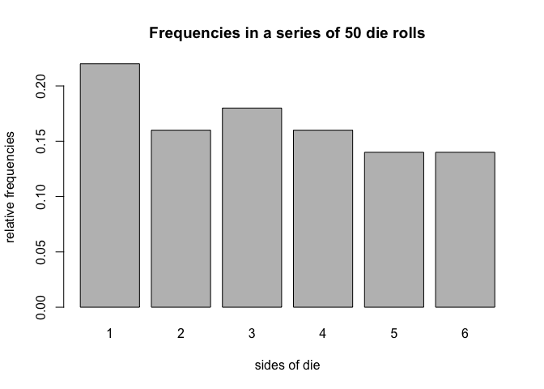
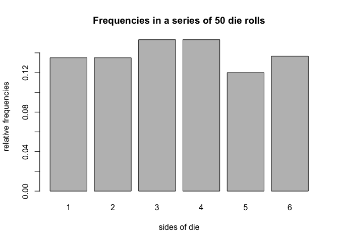

Untitled
================

``` r
library(dieroller)
```

> 1.  

``` r
# default call: creates a standard fair die
fair_die <- die() 
fair_die
```

    ## object "die"
    ## 
    ##   sides      prob
    ## 1     1 0.1666667
    ## 2     2 0.1666667
    ## 3     3 0.1666667
    ## 4     4 0.1666667
    ## 5     5 0.1666667
    ## 6     6 0.1666667

``` r
# die with non-standard sides
weird_die <- die(sides = c('i', 'ii', 'iii', 'iv', 'v', 'vi')) 
weird_die
```

    ## object "die"
    ## 
    ##   sides      prob
    ## 1     i 0.1666667
    ## 2    ii 0.1666667
    ## 3   iii 0.1666667
    ## 4    iv 0.1666667
    ## 5     v 0.1666667
    ## 6    vi 0.1666667

``` r
# create a loaded die
loaded_die <- die(prob = c(0.075, 0.1, 0.125, 0.15, 0.20, 0.35)) 
loaded_die
```

    ## object "die"
    ## 
    ##   sides  prob
    ## 1     1 0.075
    ## 2     2 0.100
    ## 3     3 0.125
    ## 4     4 0.150
    ## 5     5 0.200
    ## 6     6 0.350

``` r
 # bad sides
bad_die <- die(sides = c('a', 'b', 'c', 'd', 'e'))
```

    ## Error in check_sides(sides): 
    ## 'prob' must be a vector of length 6

``` r
# bad prob
bad_die <- die(
sides = c('a', 'b', 'c', 'd', 'e', 'f'), prob = c(0.2, 0.1, 0.1, 0.1, 0.5, 0.1))
```

    ## Error in check_prob(prob): 
    ## elements in 'prob' must add up to 1

> 1.  

``` r
# roll fair die 50 times
fair_die <- die() 
set.seed(123)
fair50 <- roll(fair_die, times = 50) 
fair50
```

    ## object "roll"
    ## 
    ## $rolls 
    ##  [1] 3 6 4 1 1 2 5 1 5 4 1 4 6 5 2 1 3 2 3 1 1 6 5 1 5 6 5 5 3 2 1 1 6 6 2
    ## [36] 4 6 3 3 3 2 4 4 4 2 2 3 4 3 1

``` r
# roll fair die 50 times
fair_die <- die()
# roll 50 times
set.seed(123)
fair_50rolls <- roll(fair_die, times = 50)
# print
fair_50rolls
```

    ## object "roll"
    ## 
    ## $rolls 
    ##  [1] 3 6 4 1 1 2 5 1 5 4 1 4 6 5 2 1 3 2 3 1 1 6 5 1 5 6 5 5 3 2 1 1 6 6 2
    ## [36] 4 6 3 3 3 2 4 4 4 2 2 3 4 3 1

``` r
# what's in fair50?
names(fair50)
```

    ## [1] "rolls" "side"  "prob"  "total"

``` r
fair50$rolls
```

    ##  [1] 3 6 4 1 1 2 5 1 5 4 1 4 6 5 2 1 3 2 3 1 1 6 5 1 5 6 5 5 3 2 1 1 6 6 2
    ## [36] 4 6 3 3 3 2 4 4 4 2 2 3 4 3 1

``` r
fair50$side
```

    ## [1] 1 2 3 4 5 6

``` r
fair50$prob
```

    ## [1] 0.1666667 0.1666667 0.1666667 0.1666667 0.1666667 0.1666667

``` r
fair50$total
```

    ## [1] 50

``` r
 # string die
str_die <- die(
  sides = c('a', 'b', 'c', 'd', 'e', 'f'),
prob = c(0.075, 0.1, 0.125, 0.15, 0.20, 0.35))
# roll 20 times
set.seed(123)
str_rolls <- roll(str_die, times = 20) 
names(str_rolls)
```

    ## [1] "rolls" "side"  "prob"  "total"

``` r
str_rolls
```

    ## object "roll"
    ## 
    ## $rolls 
    ##  [1] "f" "c" "e" "b" "a" "f" "e" "b" "d" "e" "a" "e" "d" "d" "f" "b" "f"
    ## [18] "f" "f" "a"

> 1.  

``` r
set.seed(123)

fair_50rolls <- roll(fair_die, times = 50)

fair50_sum <- summary(fair_50rolls)

fair50_sum
```

    ## summary "roll"
    ## 
    ##   side count prop
    ## 1    1    11 0.22
    ## 2    2     8 0.16
    ## 3    3     9 0.18
    ## 4    4     8 0.16
    ## 5    5     7 0.14
    ## 6    6     7 0.14

``` r
# what's in the summary
class(fair50_sum)
```

    ## [1] "summary.roll"

``` r
names(fair50_sum)
```

    ## [1] "freq"

``` r
fair50_sum$freq
```

    ##   side count prop
    ## 1    1    11 0.22
    ## 2    2     8 0.16
    ## 3    3     9 0.18
    ## 4    4     8 0.16
    ## 5    5     7 0.14
    ## 6    6     7 0.14

> 4

``` r
# plot method
plot.roll(fair_50rolls)
```



> 5

``` r
# roll fair die
set.seed(123)
fair_die <- die()
fair500 <- roll(fair_die, times = 500)
# summary method
summary(fair500)
```

    ## summary "roll"
    ## 
    ##   side count  prop
    ## 1    1    80 0.160
    ## 2    2    81 0.162
    ## 3    3    92 0.184
    ## 4    4    92 0.184
    ## 5    5    72 0.144
    ## 6    6    83 0.166

``` r
 # extracting roll in position 500
fair500[500]
```

    ## $<NA>
    ## NULL

``` r
# replacing last roll
fair500$rolls[500] <- 1
fair500[500]
```

    ## $<NA>
    ## NULL

``` r
summary(fair500)
```

    ## summary "roll"
    ## 
    ##   side count  prop
    ## 1    1    81 0.162
    ## 2    2    81 0.162
    ## 3    3    92 0.184
    ## 4    4    92 0.184
    ## 5    5    72 0.144
    ## 6    6    82 0.164

``` r
# adding 100 rolls
fair500$total <- fair500$total + 100 
fair600 <- fair500
summary(fair600)
```

    ## summary "roll"
    ## 
    ##   side count      prop
    ## 1    1    81 0.1350000
    ## 2    2    81 0.1350000
    ## 3    3    92 0.1533333
    ## 4    4    92 0.1533333
    ## 5    5    72 0.1200000
    ## 6    6    82 0.1366667

``` r
 # plot method
plot(fair500, 500)
```



> De Mere’s problem

``` r
die_d=die()

f=list(0,0,0,0)
thousand_times=rep(list(f), 1000)

for (t in 1:1000){
  roll1=roll(die_d, 4)
  g=roll1$rolls
  g=as.list(g)
  thousand_times[[t]]=g
}
```

``` r
counts=0
for(h in 1:1000){
    if ('6' %in% thousand_times[[h]]){
      counts=counts+1
  }
counts
}
```

``` r
frequency = counts/1000
approx = 1-(5/6)^4

frequency
```

    ## [1] 0.53

``` r
approx 
```

    ## [1] 0.5177469

``` r
die_d_2=die()

f1=list(0,0,0,0,0,0,0,0,0,0,0,0,0,0,0,0,0,0,0,0,0,0,0,0,0,0,0,0,0,0,0,0,0,0,0,0,0,0,0,0,0,0,0,0,0,0,0,0)

many_times=rep(list(f1), 1000)
for (t in 1:1000){
    roll1 = roll(die_d_2, 48)
    g=roll1$rolls
    g=as.list(g)
    many_times[[t]]=g
  }
```

``` r
counts1=0
sixx=0

for(h in 1:1000){
  k=1
  sixx=0
  while(k<49){
    if(many_times[[h]][[k]]==6 & many_times[[h]][[k+1]]==6){
      sixx = sixx+1
      
    }
    k=k+2
  }
  if(sixx>0){counts1=counts1+1}
}

counts1
```

    ## [1] 468

``` r
freq = counts1/1000
appro = 1-(35/36)^24

freq
```

    ## [1] 0.468

``` r
appro 
```

    ## [1] 0.4914039
